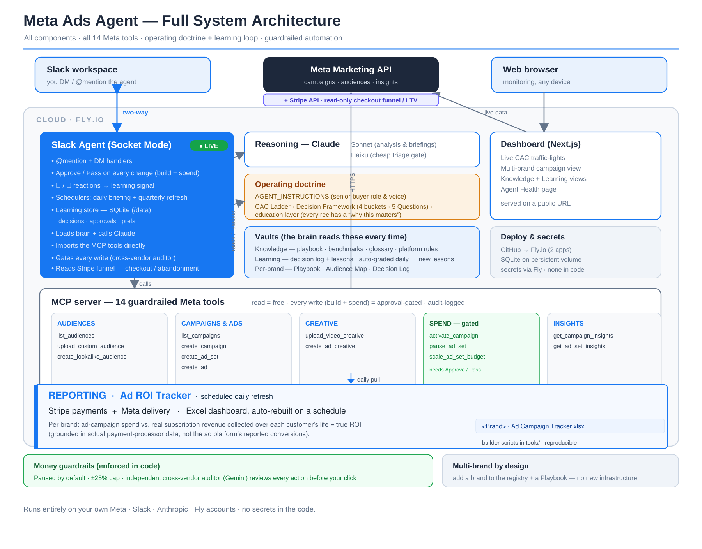

# Meta Ads Agent — System Architecture

An operator's overview of the multi-brand Meta Ads automation template. This is the *why* and *how-it-works*; **SETUP.md** is the step-by-step to stand it up.

## What this is
A standalone, multi-brand system that runs Meta (Facebook/Instagram) ads through code instead of clicking around Ads Manager. It's three connected pieces plus a built-in "brain," and it can manage any number of brands.



## The big picture
```
        Slack  (you talk to it here)
          ↑  persistent two-way connection
   ┌──────┴───────┐
   │  Slack Agent  │ --reads--> [ Knowledge vault + Learning vault + Brand playbook ]
   │   (daemon)    │ --calls--> Anthropic (Claude) = the reasoning
   └──────┬───────┘
          │ imports the same functions
          ▼
   [ MCP server ] --HTTPS--> Meta Marketing API  (campaigns, audiences, insights)

   [ Dashboard ] --HTTPS--> Meta Marketing API  (live metrics + CAC traffic-lights)
```
**In one sentence:** you message the agent in Slack; it reads your knowledge and the brand's history, reasons with Claude, and acts on Meta through guardrailed tools — while a dashboard shows the live numbers.

## The three components
| Component | What it does | Lives in |
|---|---|---|
| **MCP server** | Wraps the Meta Marketing API as safe, guardrailed tools (campaigns, ad sets, ads, audiences, insights, scale/pause). Read tools are free; spend tools are capped and gated. | `mcp/` |
| **Slack agent (daemon)** | Always-on two-way bot. DM/@mention it and it answers as a senior media buyer. One daily briefing per actively-spending brand. Money actions return as Approve/Pass buttons. | `daemon/` |
| **Dashboard** | Web page: each brand's live campaigns, CAC vs. its ladder (green/yellow/red), the vaults, and an agent-health view. | `dashboard/` |

## The agent's brain
It reasons from curated knowledge + your own results on every answer:
- **Curated knowledge (L1)** — media-buyer playbook, 2025–26 benchmarks, metric glossary, current platform mechanics. Established best practice; refresh quarterly.
- **Recursive learning (L4)** — what worked for *your* brands. Every Scale/Hold/Watch/Pause is logged; outcomes are recorded; repeated wins become "lessons" that override general benchmarks after 20+ conversions.
- **Brand context** — each brand's Playbook, Decision Log, Audience Map.

Two safety rules: **learning improves advice only** (never changes a money guardrail on its own), and **education is built in** (every rec has a one-line "why this matters").

## How it acts — and the guardrails
The agent pulls data freely but **can never spend on its own**:
- **Paused by default** — campaigns/ad sets are created PAUSED; one explicit action turns spend on.
- **Human approval on money** — scale/pause/activate come back as Approve/Pass buttons in Slack.
- **Scaling capped at ±25%** (larger jumps reset Meta's learning phase).
- **No premature pauses** — refuses to pause an ad set with <$50 spend or <3 days runtime unless forced.
- **Everything logged** to a local audit trail.

## Operating rhythm & cost
- **One briefing/day, only when a brand has an ACTIVE campaign** — zero active campaigns = zero AI calls = $0 that day.
- **On-demand answers** — you only pay for questions you ask.
- **Cheap-model triage, smart-model reasoning**, with prompt caching.

| Item | Cost |
|---|---|
| Hosting (Fly.io) — always-on bot + dashboard | ~$5–6 / month (fixed) |
| Anthropic API — per briefing/question | ~2–7¢ each |
| Typical month, one active brand | ~$15–30 all-in |

## Reporting — ad ROI tracker
An optional reporting pipeline (`tools/`) pulls live payment-processor + Meta data on a schedule and rebuilds an Excel dashboard tracking each brand's **ad-campaign spend vs. real subscription revenue collected over each customer's life** — true ROI grounded in actual payments, not the ad platform's reported conversions. Run it on a daily schedule (e.g., 6 AM). Scripts: `pull_subs`, `pull_ad_tracker`, `build_tracker_xlsx`, `build_ad_tracker_xlsx`.

## Where it runs
- **Two Fly.io apps**: dashboard + bot daemon. The bot uses Slack Socket Mode (outbound only — no public web address).
- **SQLite on a persistent disk** stores the learning record across restarts.
- **Code on GitHub**; the knowledge/learning vaults travel with it.

## Security
- **No secrets in the code** — every credential is an env var (local) or Fly secret (production), never committed.
- **You own everything** — runs entirely on your own Meta, Slack, Anthropic, and Fly accounts.

## Adding more brands
Multi-brand by design: copy the example block in the brand registry (`dashboard/lib/brands.js` + `daemon/brands.py`), point it at a brand folder with a Playbook, and it appears automatically — no new infrastructure.

---
Start with **SETUP.md**.
